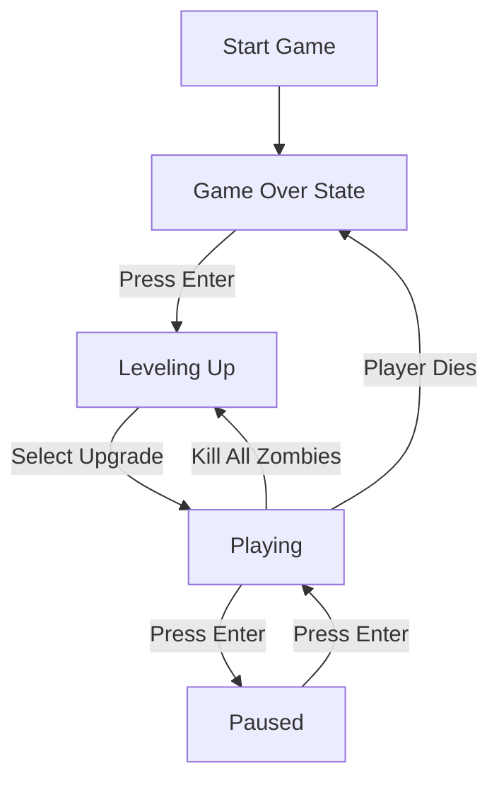

# Zombie_Arena# Zombie Arena

A top-down zombie shooter game built with SFML/C++. Fight waves of different zombie types while surviving as long as possible.

## Game Overview

In Zombie Arena, you play as a survivor fighting against hordes of zombies in an arena. The game features:

- 3 different types of zombies (Bloater, Chaser, Crawler)
- Shooting mechanics with limited ammo
- Wave-based progression
- High score system
- Upgradeable player abilities

## Controls

- **WASD** - Move the player
- **Mouse** - Aim
- **Left Click** - Shoot
- **R** - Reload weapon
- **Enter** - Pause/Unpause game
- **Escape** - Quit game

## Game Mechanics

### Player
- Health: Starts with 100 HP
- Movement Speed: 200 pixels/second
- Can be upgraded between waves

### Zombie Types
1. **Bloater**
   - High health (5 HP)
   - Medium speed (40 units)
   
2. **Chaser** 
   - Low health (1 HP) 
   - High speed (80 units)
   
3. **Crawler**
   - Medium health (3 HP)
   - Low speed (20 units)

### Weapons
- Clip Size: 6 bullets
- Spare Ammo: 24 bullets
- Fire Rate: 10 rounds/second
- Bullet Range: 1000 pixels

## Game Flow



## Project Structure

```
Zombie_Arena/
├── source/
│   ├── ZombieArena.cpp    # Main game loop
│   ├── Player.cpp         # Player class
│   ├── Zombie.cpp         # Zombie class
│   ├── Bullet.cpp         # Bullet class
│   └── CreateHorde.cpp    # Zombie spawning
├── graphics/              # Game textures
├── sound/                 # Sound effects
└── fonts/                 # Game fonts
```

## Assets Used

### Graphics
- Player sprite
- Zombie sprites (Bloater, Chaser, Crawler)
- Background textures
- Crosshair
- Blood effects

### Sounds
- Shooting
- Reloading
- Zombie hits
- Power-ups
- Player damage

## Build Instructions

1. Install SFML development libraries
2. Clone the repository
3. Compile using your preferred C++ compiler
4. Run the executable

Example build command:
```bash
g++ -c *.cpp
g++ *.o -o ZombieArena -lsfml-graphics -lsfml-window -lsfml-system
```

## Requirements

- SFML 2.0+
- C++11 compatible compiler
- Graphics card with OpenGL support